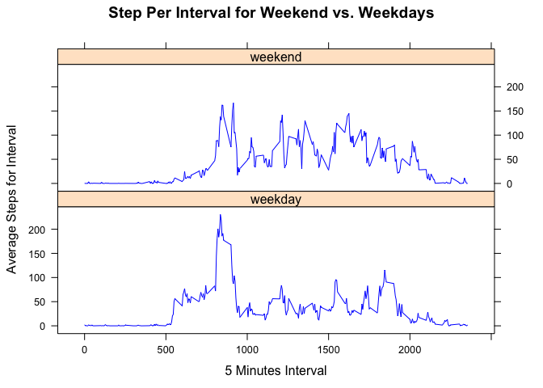

# Reproducible Research: Peer Assessment 1


## Loading and preprocessing the data

1. Set the working directory

```r
setwd("/Users/tleis/GitHub/datasciencecoursera/ReproducibleResearch/Assignment2")
```

2. Download the activity data

```r
temp <- tempfile()
download.file("https://d396qusza40orc.cloudfront.net/repdata%2Fdata%2Factivity.zip", temp)
activity <- read.csv(unz(temp, "activity.csv"))
unlink(temp)
```

## What is mean total number of steps taken per day?

1. Calculate the total number of steps taken per day

```r
stepsperday <- tapply(activity$steps, activity$date, sum)
```

2. Make a histogram of the total number os steps taken per day

```r
hist(stepsperday)
```

<!-- -->
3. Calculate and report the mean and median of the total number of steps taken per day


```r
mean(stepsperday, na.rm=TRUE)
```

```
## [1] 10766.19
```

The median is:

```r
median(stepsperday, na.rm=TRUE)
```

```
## [1] 10765
```

## What is the average daily activity pattern?

1. Make a time series plot (i.e. 𝚝𝚢𝚙𝚎 = "𝚕") of the 5-minute interval (x-axis) and the average number of steps taken, averaged across all days (y-axis)


```r
mean.stepsperinterval <- tapply(activity$steps, activity$interval, mean, na.rm=TRUE)
stepsperinterval<-unname(mean.stepsperinterval)
library(lattice)
intervals <- as.numeric(levels(as.factor(activity$interval)))
xyplot(stepsperinterval ~ intervals  , type='l', main='Average number of steps averages over all days', xlab='Interval', ylab='Steps')
```

<!-- -->

2. Which 5-minute interval, on average across all the days in the dataset, contains the maximum number of steps?

The interval with the maxium number of steps is:

```r
max <- max(stepsperinterval)
intervals[match(max, stepsperinterval)]
```

```
## [1] 835
```

The average number of steps in that maximum interval is :

```
## [1] 206.1698
```

## Imputing missing values
1. Calculate and report the total number of missing values in the dataset (i.e. the total number of rows with 𝙽𝙰s)


```r
sum(is.na(activity))
```

```
## [1] 2304
```

2. Devise a strategy for filling in all of the missing values in the dataset. The strategy does not need to be sophisticated. For example, you could use the mean/median for that day, or the mean for that 5-minute interval, etc.

Our strategy is to replace the missing value by the mean number of steps during the interval where the missing value is observed.

3. Create a new dataset that is equal to the original dataset but with the missing data filled in.


```r
activity.no.na <- activity
activity.no.na$steps[!complete.cases(activity)] <- tapply(activity$steps, activity$interval, mean, na.rm=TRUE)
```

4. Make a histogram of the total number of steps taken each day and Calculate and report the mean and median total number of steps taken per day. Do these values differ from the estimates from the first part of the assignment? What is the impact of imputing missing data on the estimates of the total daily number of steps?


```r
updatedstepsperday <- tapply(activity.no.na$steps, activity.no.na$date, sum)
hist(updatedstepsperday)
```

<!-- -->
The new mean is:

```r
mean(updatedstepsperday)
```

```
## [1] 10766.19
```

The new median is;

```r
median(updatedstepsperday)
```

```
## [1] 10766.19
```

The mean is still the same while the median is now equal to the mean as well. Imputing the missing values didn't have much difference 

## Are there differences in activity patterns between weekdays and weekends?
1. Create a new factor variable in the dataset with two levels – “weekday” and “weekend” indicating whether a given date is a weekday or weekend day.


```r
  days <- weekdays(as.Date(activity$date))
  weekday.factor <- factor(c('weekday', 'weekend'))
  activity$days[(weekdays(as.Date(activity$date)) =='Saturday' ) | (weekdays(as.Date(activity$date)) =='Sunday' ) ] <- 'weekend' 
  activity$days[!(weekdays(as.Date(activity$date)) =='Saturday' ) & !(weekdays(as.Date(activity$date)) =='Sunday' ) ] <- 'weekday' 
  activity$days <- as.factor(activity$days)
```

2. Make a panel plot containing a time series plot (i.e. 𝚝𝚢𝚙𝚎 = "𝚕") of the 5-minute interval (x-axis) and the average number of steps taken, averaged across all weekday days or weekend days (y-axis). 


```r
weekdays <- activity[activity$days=='weekday',]
steps.weekdays <- unname(tapply(weekdays$steps, weekdays$interval, mean, na.rm=TRUE))
library(lattice)
intervals <- as.numeric(levels(as.factor(activity$interval)))
xyplot(steps.weekdays ~ intervals  , type='l', main='Average number of steps over all week days',  xlab='Interval', ylab='Steps')
```

<!-- -->


```r
weekends <- activity[activity$days=='weekend',]
steps.weekends <- unname(tapply(weekends$steps, weekends$interval, mean, na.rm=TRUE))
intervals <- as.numeric(levels(as.factor(activity$interval)))
xyplot(steps.weekends ~ intervals  , type='l', main='Average number of steps over all weekends', xlab='Interval', ylab='Steps')
```

<!-- -->
